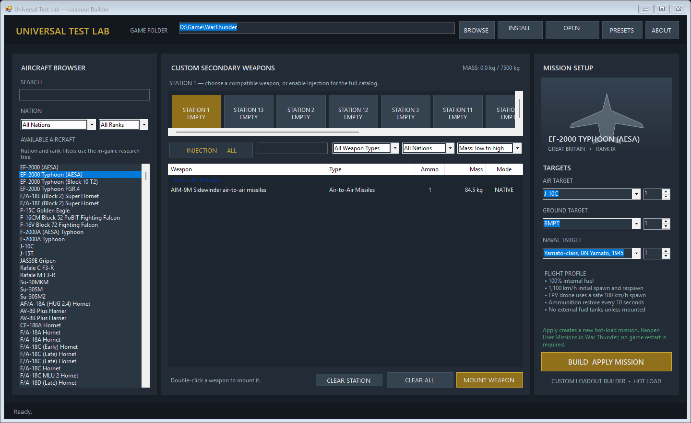

# Universal Test Lab

Universal Test Lab is a Windows GUI for building hot-load War Thunder User Missions with configurable aircraft, custom pylon loadouts, and air, ground, or naval targets.



## Features

- 1,393 aircraft and player vehicles with nation and rank filters.
- 1,628 weapon, rack, targeting-pod, and experimental ground-SAM entries.
- Native aircraft mounts and optional cross-aircraft weapon injection.
- Editable internal bomb bays for aircraft such as the B-52H and Tu-95M.
- Configurable air, ground, and naval targets, including hostile air-defence systems.
- Named custom presets stored locally on the PC.
- The selected War Thunder folder is remembered, so the EXE can be kept anywhere.
- Hot mission rebuilding without restarting War Thunder.
- 100% internal fuel and adaptive initial/respawn speeds: 1,100 km/h for modern jets, 700 km/h for early jets (Rank V or below), 450 km/h for propeller aircraft, and 100 km/h for the FPV drone.
- Ten-second ammunition restoration.

## Installation

1. Download the latest `Universal_Test_Lab` ZIP from Releases and extract it.
2. Keep `UniversalTestLab.exe` in any folder and run it.
3. Select the War Thunder root folder once, then select **Install Base**. The path is saved locally for future launches.
4. Build a setup with **Build & Apply Mission**.
5. In War Thunder, close the **User Missions** tab/window completely and open **User Missions** again. This refreshes the generated mission.
6. Launch the current **HOT UTL** mission.

The executable is not digitally signed, so Windows SmartScreen may show a warning.

Simply returning to the already-open User Missions list is not enough after regeneration; the tab must be closed and opened again.

## Important injection limitation

War Thunder's built-in F2 selector does not enumerate hot-injected foreign weapon types, even when those weapons are physically mounted and operational. Native mounts remain the most reliable. Experimental ground-SAM adapters and foreign targeting pods may depend on systems not provided by the selected aircraft.

## Support the project

If Universal Test Lab is useful to you, optional support is available through the secure [Stripe payment page](https://buy.stripe.com/bJe00bbHB0GH0qI655fQI00). The repository's **Sponsor** button opens the same page.

<a href="https://buy.stripe.com/bJe00bbHB0GH0qI655fQI00"></a>

## Inspiration and thanks

This project was inspired by [Ask3lad's War Thunder custom-mission GUI video](https://youtu.be/k0_Cz1ytgrQ?si=Sa5fDdDP8CatKawM). Visit the [Ask3lad YouTube channel](https://www.youtube.com/@Ask3lad); his project also provides GUI tools for ground and naval vehicles.

## Building from source

Requirements:

- Windows
- .NET Framework 4.x
- PowerShell

Build and run the embedded self-test:

```powershell
.\Build.ps1 -SelfTest
```

The compiled application is written to `dist\UniversalTestLab.exe`.

`Build-Catalog.ps1` regenerates catalog TSV files from locally extracted War Thunder resources. Those extracted source archives are intentionally not included in this repository.

## Contributing

Bug reports and feature proposals are welcome through GitHub Issues. See [CONTRIBUTING.md](CONTRIBUTING.md) before submitting code changes.

## Legal and third-party software

Universal Test Lab is an independent fan-made project and is not affiliated with or endorsed by Gaijin Entertainment. War Thunder and related names and assets belong to their respective owners.

The application embeds [`wt_ext_cli`](https://github.com/Warthunder-Open-Source-Foundation/wt_ext_cli) under the Apache License 2.0. See [THIRD_PARTY_NOTICES.md](THIRD_PARTY_NOTICES.md) and [resources/WT_EXT_LICENSE.txt](resources/WT_EXT_LICENSE.txt).

The project source is available under the [MIT License](LICENSE). Third-party components and game-derived data or resources are excluded from that license unless their own notice says otherwise.
